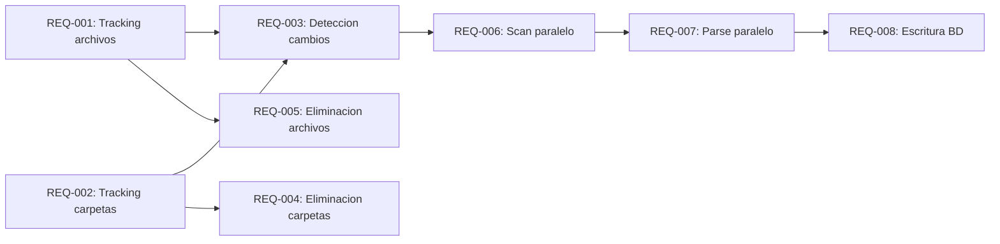

# Spec: Optimizacion del Indexador para Actualizaciones Frecuentes

<!--
SPEC-V2-METADATA:
  version: "2.0"
  created: "2026-01-23"
  language: "es"
  quality:
    overall: 85
    ambiguity: 90
    testability: 82
    completeness: 84
  requirements_count: 8
  dependencies_count: 7
-->

## Objetivo de Negocio

Permitir ejecutar el indexador con frecuencia (cambios de rama, pre-commit hooks)
sin penalizar el flujo de trabajo. Actualmente la reindexacion es lenta porque:
1. Recorre carpetas secuencialmente
2. Parsea archivos secuencialmente
3. No detecta eficientemente que archivos cambiaron
4. No detecta archivos/carpetas eliminados

## Suposiciones Confirmadas

- [x] El cuello de botella principal es el parsing AST (CPU-bound)
- [x] SQLite puede manejar escrituras desde un solo thread (WAL mode)
- [x] Objetivo: <5 segundos para actualizaciones incrementales tipicas
- [x] Los embeddings quedan fuera de esta optimizacion (lentos por diseno)
- [x] Se debe conservar la funcionalidad de embeddings aunque no se use

## Requisitos

### REQ-001: Tracking de archivos individuales

| Campo | Valor |
|-------|-------|
| **Sistema** | Schema de base de datos |
| **Accion** | Crear tabla `indexed_files` con: file_path (PK), folder_id (FK), file_hash (MD5 del contenido), last_modified (timestamp del filesystem), indexed_at, chunks_count |
| **Criterio** | Tabla creada con indices en folder_id y file_hash |

### REQ-002: Tracking de estructura de carpetas

| Campo | Valor |
|-------|-------|
| **Sistema** | Schema de base de datos |
| **Accion** | Extender tabla `indexed_folders` con: folder_hash (hash derivado de hijos), parent_folder_id (FK nullable), subfolders_list (JSON array de nombres) |
| **Criterio** | Migracion automatica de schema existente sin perdida de datos |

### REQ-003: Deteccion optimizada de cambios (Merkle-style)

| Campo | Valor |
|-------|-------|
| **Trigger** | Usuario ejecuta indexacion de una carpeta |
| **Sistema** | TFolderScanner / nuevo TChangeDetector |
| **Accion** | Comparar folder_hash almacenado vs hash calculado del filesystem. Si coincide, skip completo. Si difiere, descender solo a subcarpetas con hash diferente |
| **Criterio** | Para carpeta sin cambios: tiempo de verificacion < 100ms para 10,000 archivos |

### REQ-004: Deteccion de eliminaciones a nivel carpeta

| Campo | Valor |
|-------|-------|
| **Trigger** | Al escanear una carpeta indexada |
| **Sistema** | TChangeDetector |
| **Accion** | Comparar subfolders_list almacenado vs subdirectorios actuales. Para cada carpeta faltante, eliminar recursivamente de BD (CASCADE) sin escanear archivos |
| **Criterio** | Eliminacion de subcarpeta con 1000 simbolos < 500ms |

### REQ-005: Deteccion de eliminaciones a nivel archivo

| Campo | Valor |
|-------|-------|
| **Trigger** | Al escanear una carpeta sin cambio de folder_hash pero con archivos modificados |
| **Sistema** | TChangeDetector |
| **Accion** | Comparar lista de archivos en BD vs archivos actuales en filesystem. Eliminar simbolos de archivos faltantes |
| **Criterio** | Deteccion de archivo eliminado sin full-scan de contenido |

### REQ-006: Escaneo paralelo de carpetas

| Campo | Valor |
|-------|-------|
| **Sistema** | TParallelFolderScanner |
| **Accion** | Usar TParallel.For o TTask para escanear multiples subcarpetas simultaneamente. Cada thread recolecta lista de archivos, luego merge en thread principal |
| **Criterio** | Speedup >= 2x en carpetas con 4+ subcarpetas en CPU de 4+ cores |

### REQ-007: Parsing AST paralelo

| Campo | Valor |
|-------|-------|
| **Sistema** | TASTProcessor / nuevo TParallelASTProcessor |
| **Accion** | Crear pool de workers (N = CPU cores). Cada worker tiene su propia instancia de parser. Cola thread-safe de archivos a procesar. Workers producen chunks a cola de resultados |
| **Criterio** | Speedup >= 3x en 100+ archivos en CPU de 4+ cores |

### REQ-008: Escritura BD desde thread unico

| Campo | Valor |
|-------|-------|
| **Sistema** | TDatabaseBuilder |
| **Accion** | Mantener escritura desde thread principal. Workers de parsing envian resultados a cola thread-safe. Thread principal consume cola y escribe a BD en batches |
| **Criterio** | Sin errores de concurrencia SQLite. Batch size configurable (default: 100) |

## Dependencias

**Orden de implementacion sugerido**:
1. REQ-001 + REQ-002 (schema) - Base para todo lo demas
2. REQ-003 (deteccion cambios) - Mayor impacto inmediato
3. REQ-004 + REQ-005 (eliminaciones) - Completa el ciclo incremental
4. REQ-006 (scan paralelo) - Optimizacion I/O
5. REQ-007 + REQ-008 (parse paralelo) - Optimizacion CPU

## Restricciones (NO Hacer)

- ❌ No modificar delphi-lookup excepto para compatibilidad con nuevo schema
- ❌ No eliminar funcionalidad de embeddings (debe seguir funcionando)
- ❌ No usar escrituras paralelas a SQLite (WAL permite solo 1 writer)
- ❌ No asumir que DelphiAST es thread-safe (crear instancia por worker)

## Fuera de Alcance

- Optimizacion de generacion de embeddings (Ollama)
- Cambios en el formato de salida de delphi-lookup
- Indexacion de otros lenguajes (Python, TypeScript)
- Watch mode / filesystem notifications en tiempo real

## Algoritmos de Referencia

### Merkle Tree para deteccion de cambios
- Fuente: [Using Merkle Trees to Efficiently Detect Data Changes](https://jsdevspace.substack.com/p/using-merkle-trees-to-efficiently)
- Complejidad: O(log n) vs O(n) para detectar cambios
- Aplicacion: folder_hash = hash(sorted(child_hashes + file_hashes))

### Escaneo paralelo de carpetas
- Fuente: [FreeFileSync](https://freefilesync.org/) - escanea cientos de miles de archivos en segundos
- Patron: Parallel.For sobre subdirectorios, merge de resultados

### Sincronizacion incremental
- Fuente: [Mutagen - Three-way merge](https://mutagen.io/documentation/synchronization/)
- Patron: Comparar estado actual vs ultimo estado conocido vs filesystem

## Quality Summary

| Metrica | Score | Estado |
|---------|-------|--------|
| Ambiguedad | 90 | ✅ |
| Testeabilidad | 82 | ✅ |
| Completitud | 84 | ✅ |
| **Overall** | **85** | **✅ PASS** |
